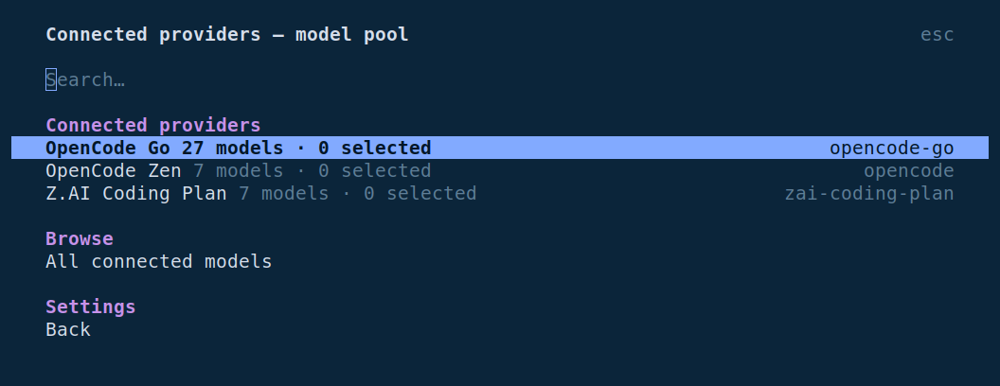
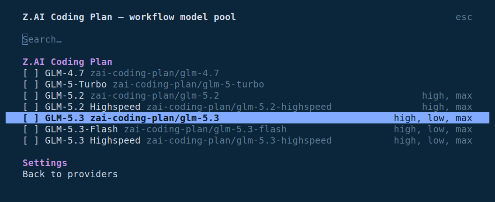
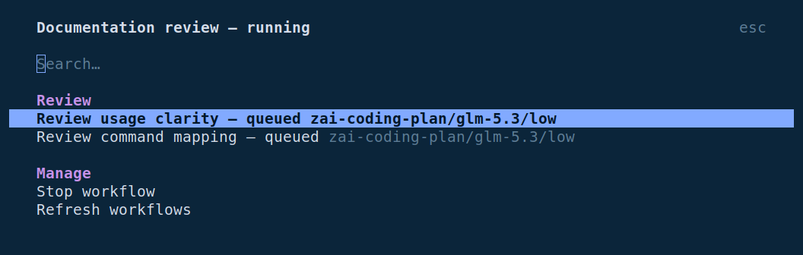
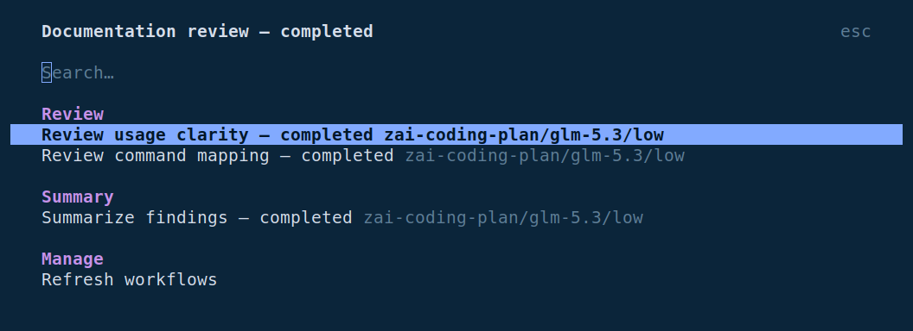

<div align="center">

<picture>
  <source media="(prefers-color-scheme: dark)" srcset="assets/hero-dark.svg" />
  <source media="(prefers-color-scheme: light)" srcset="assets/hero-light.svg" />
  
</picture>

### Describe the work. Get the right team. Watch it happen.

Let the model choose a focused team from your configured pool.<br />Run real OpenCode child sessions with live sidebar progress. Keep every successful result.

[](#quick-start) [](#development) [](LICENSE)

**[Get started](#quick-start)** &nbsp; / &nbsp; **[Usage](#usage)** &nbsp; / &nbsp; **[See it running](#workflows-in-action)** &nbsp; / &nbsp; **[Choose models](#your-team-your-models)** &nbsp; / &nbsp; **[Resume work](#keep-the-work-youve-already-done)**

</div>

<br />

<table>
<tr>
<td width="33%" valign="top">
<sub>01 &nbsp; COMPOSE</sub>
<h3>Think beyond one agent.</h3>
<p>Use loops, branches, parallel tasks, and pipelines. Give each assignment its own OpenCode session.</p>
</td>
<td width="33%" valign="top">
<sub>02 &nbsp; COORDINATE</sub>
<h3>Keep the work in view.</h3>
<p>Choose models, validate handoffs, name phases, and open child sessions. Skip a task or stop the run.</p>
</td>
<td width="33%" valign="top">
<sub>03 &nbsp; CONTINUE</sub>
<h3>Save the progress.</h3>
<p>Successful results are journaled before returning. Resume matching work after interruption or a script edit.</p>
</td>
</tr>
</table>

<p align="center"><sub>Version 0.1.0 · Automatic team planning · Native model picker · Live workflow sidebar</sub></p>

<br />

## One script. Many moving parts.

Review each file, then verify its findings. Each item moves forward as soon as its own review is ready.

```js
const findings = await pipeline(
  args.files,

  file => agent(`Review ${file}. Include concrete findings and locations.`, {
    label: file,
    phase: "Review",
  }),

  (review, file) => {
    if (review === null) return null;
    return agent(`Verify this review of ${file}:\n${review}`, {
      label: file,
      phase: "Verify",
    });
  },
);

return findings.filter(result => result !== null);
```

<div align="center">

<picture>
  <source media="(prefers-color-scheme: dark)" srcset="assets/pipeline-dark.svg" />
  <source media="(prefers-color-scheme: light)" srcset="assets/pipeline-light.svg" />
  
</picture>

</div>

<p align="center"><sub>Illustrated execution flow. Use <code>parallel()</code> when the next step needs every result.</sub></p>

<br />

## Quick start

Requires OpenCode 1.18.29 or later and Git. If repository access requires authentication, run `gh auth login` and `gh auth setup-git` once, or use your existing Git HTTPS credentials.

**Install for the current project:**

```sh
opencode plugin git+https://github.com/pacmm255/opencode-workflow-engine.git
```

**Install globally:**

```sh
opencode plugin -g git+https://github.com/pacmm255/opencode-workflow-engine.git
```

OpenCode's native installer registers both the workflow tools and terminal dialogs. Restart OpenCode after installation. No shell bootstrap, manual path editing, or public npm package is required.

<details>
<summary><strong>Installation, updates, and native dialogs</strong></summary>

For private repository access, Git must be authenticated with an account that can read it. The native command installs directly from Git, not a public npm package.

Add `-f` to the appropriate install command to replace the installed version. Keep `-g` for a global installation. OpenCode manages plugin registration in both its server and TUI configuration; project configuration can override global settings.

Git installs load the TypeScript entrypoints directly in OpenCode. The authoring guide is generated in OpenCode's cache, so no build step or generated Markdown needs to be committed.

The earlier [shell installer](install.sh) and [configuration helper](scripts/configure.ts) remain available for existing managed-directory installations, but are no longer the recommended setup.

**Switching from the earlier shell installer?** Remove its Workflow Engine entries from both global `opencode.json` / `opencode.jsonc` and `tui.json` / `tui.jsonc` before using the native command. Keep unrelated plugins. OpenCode treats the old file entries and the Git package as different installations; `-f` does not remove the old entries.

`/workflow-config` (also `/workflow_config`) opens native settings in OpenCode's terminal UI. `/workflows` opens run details and child sessions, with stop and skip controls.

For an SSH tunnel, set `remote: true` in the installed TUI plugin entry's options in `tui.json` or `tui.jsonc`; retain the generated entry. Remote dialogs prepare requests for the server tools. Local dialogs manage local configuration and run files.

</details>

<br />

## Usage

Restart OpenCode after installation or an update. In the terminal UI, open the workflow settings page:

```text
/workflow-config
```

`/workflow_config` is an alias for the same page. It opens directly—no chat prompt or model call.

Settings save to the project by default. Choose **Save scope** first if you want global settings. You can also open this page from **Configure workflow models** in OpenCode's command palette.

1. Select **Connected providers and model pool**.
2. Choose an OpenCode connection, or **All connected models**.
3. Select models to toggle them in the pool. `[x]` marks selected models; changes save immediately to the chosen project or global scope.

<p align="center">
  <a href="assets/workflow-config.png"></a>
</p>
<p align="center"><sub>Your OpenCode connections, inside <code>/workflow-config</code>. Open any screenshot at full size.</sub></p>

Captured in OpenCode 1.18.30 with the project's real provider connections. Only the dialog framing is cropped; the UI is unchanged.

<p align="center">
  <a href="assets/workflow-models.png"></a>
</p>
<p align="center"><sub>Browse a connection's real model catalog. Select a model to toggle it in the pool.</sub></p>

**Default model** uses the same connection and model lists. The page also controls strict mode, advisory workflow size, and save scope. Its catalog comes from the same live provider data as OpenCode's `/models`, with deprecated models excluded. If the list is empty, use `/connect`, check `/models`, and reopen the workflow settings.

The installer includes the native TUI plugin. For an explicitly chat-based fallback without it, use `/workflow-config-chat` or `/workflows-chat`; those commands intentionally ask the model to use server tools.

Then give the workflow a task:

```text
/workflow Review the current changes from correctness and test-coverage perspectives, then verify the findings.
```

The model reads the live configuration, chooses the smallest sufficient team, and explains each task/model assignment. It submits a structured plan; the engine creates the orchestration internally, without a script-writing diff in the conversation. Omitted agent counts are a planning decision, not a fixed two-agent template. Explicit user assignments are respected within the configured policy.

Automatic choices use your selected model pool. With no pool, they use the effective default/session model. Reported model prices and capabilities inform the choice; missing prices are not treated as free. Configured OpenCode subagent roles are listed separately from model choices. Plans run in the background by default.

OpenCode can discover compatible skills from `.claude` directories. Workflow planning does not require its recurring `loop` or Ralph skills, and unrelated loop-skill calls are rejected during `/workflow` planning. Explicit requests for those skills and relevant task-specific skills remain available; the plugin does not change global skill discovery.

| Command | Action |
| :--- | :--- |
| `/workflow-config` or `/workflow_config` | Open native settings and select connected providers/models. |
| `/workflow <task>` | Choose a team, explain assignments, and run a plan without displaying orchestration source. |
| `/ultracode` | Enable automatic workflows for this session, choose effort, or return to the configured default. |
| `/workflow-dismiss` | Dismiss or restore automatic triggering for the next prompt. |
| `/workflows` | View this session's runs and child sessions; use native stop and skip controls. |
| `/workflow-stop [runId]` | Request stopping a specific run, or the latest active run in this session. |
| `/workflow-goal <objective>` | Keep planning workflows until the objective has fresh acceptance evidence. |
| `/workflow-goal [status\|history\|pause\|resume\|stop]` | Inspect or control this session's persistent goal. No arguments means status. |
| `/workflow-goal edit <objective>` | Revise the goal and invalidate earlier acceptance checks. |
| `/workflow-goals` | Native goal dashboard, acceptance checks, paginated history, and controls. |

### Persistent workflow goals

```text
/workflow-goal Implement the requested feature, run its tests, and verify the actual application behavior. Do not publish changes.
```

The supervisor defines acceptance criteria, checks whether they are already met, then creates the next useful workflow for unmet requirements. Each workflow is followed by fresh independent verification. It continues until acceptance succeeds, you pause/stop it, or a prerequisite needs your input. It never treats a finished workflow alone as a finished goal.

There is **no goal-wide token, cost, workflow-count, iteration, or duration ceiling**. Usage is informational. Individual workflows still have finite timeouts, agent/concurrency limits, cancellation, and normal OpenCode permissions. Starting a goal does not authorize publishing, destructive changes, or expanding its scope. Repeated recoverable failures back off without an aggregate retry cap; denied authority remains a blocker.

Goal mode complements Ultracode: the goal determines **what must be achieved and when to stop**; Ultracode supplies workflow behavior and supported reasoning effort. Enable `/ultracode`, then start `/workflow-goal`. Goal-owned results go to one supervisor, without extra Ultracode continuation prompts. You can also use goals without enabling Ultracode. Coordinator stages use the first configured pool model, or the effective default/session model when the pool is empty; worker plans choose from the actual pool. Unavailable configured models wait for repair rather than silently switching providers.

`/workflow-goals` (alias `/workflow_goals`) opens native controls without a model call. The singular `/workflow-goal` belongs to the server, preserving inline objective arguments. Pause cancels owned operations and retains a resumable goal; resume rechecks partial work. Stop permanently cancels the goal and retains its history. Stopping a goal-owned run in `/workflows` pauses its supervisor too. An explicit parent-session abort also pauses it; closing a dialog does not. A revised objective gets a new generation and checklist, so late results cannot satisfy the new objective.

State and paginated history live in a separate SQLite database under OpenCode's workflow application-data directory, outside your repository. Reserved operation/run IDs and a project lease prevent duplicate scheduling across plugin instances. Active goals reconcile known children after restart; paused/cancelled goals stay stopped. OpenCode must be running with the project loaded—this is not a separate always-on daemon. Each project admits one goal operation at a time; pause active goals before independent workflows or parent edits. Use separate sessions for other goal/loop plugins: their internal state is not automatically detected or disabled.

Completion requires one current evidence entry per criterion, a fresh verifier context, and matching workspace fingerprints before/after verification. Failed, skipped, missing, or malformed results cannot complete a goal. Direct verifier editing tools are disabled; validation commands retain normal host permissions. Git projects fingerprint tracked and nonignored files, including dirty/untracked content; non-Git projects exclude tool/config directories and `node_modules`. Ignored files, external systems, symlink targets, and submodule contents need explicit reviewer checks; a fingerprint is not proof of their freshness. Verification quality still depends on the selected model and available checks, not a guarantee of convergence or correctness. If final notification delivery is uncertain, inspect status/history; the supervisor does not blindly duplicate the notification.

### Automatic workflows with Ultracode

Open `/ultracode` and select **Enable Ultracode**. Describe your task normally: the model decides whether a workflow helps, chooses its team, and can run investigation, implementation, and verification as successive workflows. Simple questions still receive direct answers. The sidebar follows each run, and completed results return automatically.

Session mode requests `xhigh` reasoning only where the selected model supports that exact variant. **Enable with current effort** keeps your existing effort; **Use high effort** disables automatic orchestration and requests exact `high` where supported. Models without those variants retain their existing supported behavior. Settings survive reopening the session; choosing a mode from the home screen applies it to the next session.

For one task, leave session mode off and type:

```text
ultracode implement the feature and verify it with the relevant tests
```

The keyword is a one-shot opt-in from a human terminal submission. It does not enable persistent mode or change reasoning effort. Quoted examples, code blocks, synthetic notifications, and ordinary unstamped SDK payloads do not activate it. `/workflow-dismiss` suppresses the next prompt's automatic trigger; a request such as “do this without workflows” also opts out. Stopping a run or skipping its work prevents automatic continuation of that run, and a later user request supersedes an older workflow's continuation.

To start new sessions in automatic mode, turn on **Ultracode by default** in `/workflow-config`. **Ultracode keyword trigger** controls the one-shot keyword independently. Both settings honor project/global scope. Disabling session mode affects future orchestration; use `/workflows` or `/workflow-stop` to stop work already running.

<details>
<summary><strong>Other clients and Claude compatibility</strong></summary>

The server tool `workflow_mode` offers `show`, `set`, and `reset`. For example, `{"action":"set","enabled":true}` enables this session; `{"action":"set","enabled":false,"effort":"high"}` returns to high effort. These controls leave project/global defaults unchanged.

SDK and other UI integrations can explicitly attest a human-submitted text part with `metadata: {"workflowOrigin":"human"}`; `metadata: {"workflowOptOut":true}` dismisses that prompt's automatic trigger. The host application is responsible for distinguishing human submissions from relayed or automated content. Automation sharing the terminal's SDK client must mark its prompts synthetic or set `workflowOrigin` to `automation`. Session mode also works for SDK requests without a keyword. The OpenCode web and IDE clients do not currently add this plugin's human-origin marker automatically.

This implements the automatic orchestration behavior using OpenCode's plugin APIs. It uses `/ultracode` and `/workflow-dismiss`; it does not replace OpenCode's model picker, add Claude's `--effort` CLI flag, or reproduce Claude's inline keyword highlight and shortcut. Model quality and semantic decisions depend on the selected provider/model. See [Claude's Ultracode behavior](https://code.claude.com/docs/en/workflows#let-claude-decide-with-ultracode) for the comparison.

</details>

### Workflows in action

The **Workflows** sidebar updates automatically with running phases, agent status, assigned models, and selection reasons. Open `/workflows`, then select a run to inspect its agents, models, and phases. Select an agent to open its child session. **Refresh workflows** reloads the detailed dialog; the sidebar updates independently.

<p align="center">
  <a href="assets/workflow-running.png"></a>
</p>
<p align="center"><sub>Started · Two review agents queued on GLM-5.3.</sub></p>

<p align="center">
  <a href="assets/workflow-completed.png"></a>
</p>
<p align="center"><sub>Completed · Two independent reviews, followed by a summary. All three child results are retained.</sub></p>

Both captures follow the same real GLM-5.3 workflow. These earlier captures show the detail dialog, not the new live sidebar.

<details>
<summary><strong>Run your own script</strong></summary>

Save the earlier example as `review.js`, then ask the model to call the `workflow` tool with:

```json
{
  "scriptPath": "review.js",
  "args": { "files": ["package.json", "README.md"] },
  "background": true,
  "tokenBudget": 20000
}
```

For advanced scripting, supply exactly one source: inline `script`, `scriptPath`, or a saved workflow `name`, without `plan`. Normal `/workflow` tasks use a declarative plan instead. Scripts run in an async body with top-level `await` and `return`. Optional `export const meta` accepts literal metadata.

Always await dispatched work and handle `null` results. Any unfinished child calls are cancelled when the script returns.

</details>

<br />

## Your team. Your models.

Use the session's model to get started. Open `/workflow-config` when you want an allowed pool or a different default. The catalog comes from OpenCode's configured providers and includes their model variants. Set aliases and hard execution limits through `workflow_config` or configuration JSON.

**Explicit choice → selected agent's model → workflow default → session model.**

Exact model IDs, aliases, unique short IDs, and variants are supported. Ambiguous names produce an error with candidates.

<details>
<summary><strong>Configure a model pool and execution limits</strong></summary>

```json
{
  "models": {
    "allowed": [],
    "default": "session",
    "strict": false,
    "aliases": {}
  },
  "limits": { "maxConcurrency": 4 },
  "defaults": { "retries": 1 },
  "sizeGuideline": 15
}
```

This example inherits the session model without restricting the pool. Choose exact IDs from `workflow_config show` before adding allowed models or aliases. Global and project settings each use `workflow.json` in their respective OpenCode configuration directories.

Project fields override global fields. Arrays replace; aliases merge by name. In strict mode, explicit choices and explicitly selected `agentType` models must belong to the allowed pool. Aliases cannot bypass it. Inherited session and workflow defaults remain usable.

`models.default` sets the model for ordinary workflow agents. `sizeGuideline` is advisory; `limits.maxAgents` is the hard cap. A configured provider can still fail because of credentials or quota.

</details>

<br />

## Keep the work you've already done.

Each successful agent result is **appended and synced before it returns**. If a run stops, ask OpenCode to resume using the saved script, run ID, and original arguments from the run report:

```text
Resume the interrupted workflow using its saved script and original arguments.
```

Matching prompts and semantic options reuse successful results. Changed work runs again. Labels, phases, timeouts, and retry settings can change without losing a match; cached results add no token spend.

> [!IMPORTANT]
> Replay reuses earlier results. Source changes and updated model/config defaults do not automatically invalidate them. Supply the script's arguments again, and omit `resumeFromRunId` when you need fresh results.

<details>
<summary><strong>Inside a saved run</strong></summary>

Each saved run includes `script.js`, `args.json`, `run.json`, `journal.jsonl`, and `result.json`, plus individual agent records with prompts, options, sessions, and results.

Runs are stored in OpenCode's local workflow data directory. Records contain prompts and results; keep them local and private.

Repeated identical calls consume cached successes in invocation order. Failed/skipped calls are never cached as successes. Prompt, schema, model options, agent type, system text, isolation, and tool choices affect matching.

Runs whose owning process has exited are marked interrupted. Recovery never restarts them automatically.

</details>

<br />

## A few good starting points.

| Workflow | What happens | Input |
| :--- | :--- | :--- |
| **[`review-changes`](workflows/review-changes.js)** | Review from three perspectives, then verify each set of findings. | `{ "task": "optional focus" }` |
| **[`research`](workflows/research.js)** | Research a question, then check and synthesize the evidence. | `{ "question": "…" }` |
| **[`audit`](workflows/audit.js)** | Inspect failure handling, persistence, and resource cleanup. | `{ "target": "optional target" }` |
| **[`implement-plan`](workflows/implement-plan.js)** | Implement ordered tasks, stop on failure, and review the result. | `{ "tasks": ["…", "…"] }` |

Call the `workflow` tool with a saved name:

```json
{
  "name": "review-changes",
  "args": { "task": "Review the current changes. Focus on cancellation." },
  "background": true
}
```

<details>
<summary><strong>The scripting API</strong></summary>

| API | Purpose |
| :--- | :--- |
| `agent(prompt, options?)` | Run a child; receive text, a validated object, or `null` on failure/skip/timeout. |
| `parallel(thunks)` | Run independent tasks and collect results in input order. |
| `pipeline(items, ...stages)` | Advance each item through stages independently. |
| `workflow(nameOrRef, args)` | Run one nested workflow with shared concurrency, caps, and budget. |
| `phase(title)` / `log(value)` | Organize phases and record progress. |
| `args` | Access the supplied JSON arguments. |
| `budget` | Read the configured total, spend, and remaining output tokens. |

Read `workflow_reference` in OpenCode for schemas, variants, timers, nesting, failure behavior, and replay semantics.

</details>

<details>
<summary><strong>Tools, controls, and execution behavior</strong></summary>

The tools are `workflow`, `workflow_reference`, `workflow_runs`, `workflow_saved`, `workflow_config`, and `workflow_mode`. `workflow_runs` provides list/status/stop/skip actions. Deleting a saved script with `workflow_saved` archives it for recovery.

**Foreground** waits for completion and follows the invoking tool's cancellation signal. **Background** owns its own signal, survives the end of that step, and reports when the parent is observed idle.

- **Outcomes:** failures after retries, skips, and agent timeouts return `null`; deterministic model/schema errors reject. Parallel/pipeline item exceptions become `null`.
- **Budgets:** output and reasoning across all attempts count toward spend. Exhaustion stops new dispatches; already-running agents can overshoot.
- **Cancellation:** workers and children are stopped. `STOP` and `SKIP_a_1` files in the run directory also provide controls.
- **Delivery:** the parent retains its current model and agent. Another turn can race the idle check; reports remain on disk if notification fails.
- **Worktrees:** `{ isolation: "worktree" }` is experimental. Created worktrees are retained; merge and remove them manually.
- **Trust:** the worker and VM provide stability for trusted model-authored scripts, not a security boundary for hostile JavaScript. Child agents retain OpenCode permissions.

</details>

<br />

## Tested where the work happens.

<table>
<tr>
<td width="33%" align="center"><h2>341</h2><p>unit tests passed</p></td>
<td width="33%" align="center"><h2>14</h2><p>real-server integration tests passed</p></td>
<td width="33%" align="center"><h2>1.18.30</h2><p>OpenCode version verified</p></td>
</tr>
</table>

The integration harness starts a real OpenCode server with isolated configuration and a local deterministic model fixture. It checks actual child sessions, native structured output, resume, background survival, stop/skip, parent cancellation, and a retained git worktree.

**19 real-terminal checks** exercise both configuration command spellings, connected-provider/model pages, persisted selections, global scope, and native Ultracode controls, then run plans through `/workflow`, a human keyword, and an ordinary session-mode prompt. They also start `/workflow-goal` with inline arguments, open its native controls, pause/resume real goal work, and observe independently verified completion with Ultracode enabled. Opening settings still creates no chat sessions or model API requests.

**10 native-install checks** cover project/global registration, repeat installs, Git package installation without a build, generated authoring-guide discovery, and real child sessions from both inline and saved workflows. The exact private-GitHub project and global commands above were also verified with authenticated downloads and real-server execution.

<details>
<summary><strong>Verification scope</strong></summary>

Recorded on September 9, 2026 with Bun 1.4.2 and OpenCode 1.18.30. These are recorded test results, not live CI indicators.

Unit coverage includes model/config policy, schemas, replay, cancellation, timed-out transports, late replies, missing-worker initialization, plugin registration, native dialog APIs, and installer preservation/failure handling.

Plan coverage additionally checks full-team preflight, model selection and rationale, dependency failures, exact model/variant preservation, and source-free replay. The real-server suite verifies hidden command instructions and rejection of unrelated loop-skill reads without changing ordinary sessions.

Ultracode coverage checks human provenance, quoted/reference text, session persistence, per-prompt opt-out, exact reasoning variants, child recursion prevention, inherited permissions, and continuation only for the original request. Real-server fixtures exercise successive implementation/verification workflows and direct answers to simple questions. These are deterministic transport and lifecycle checks, not proof of every model's planning quality.

Goal coverage includes 1,200 deterministic workflow cycles over simulated multi-day time without an aggregate ceiling, transactional ownership, duplicate wakeups, restart reconciliation, objective revisions, stale/missing evidence, permission failures, transport cancellation, and fresh verification without replay. The real-server goal test uses an offline acceptance oracle to exercise two successive workflows and exactly one final notification; it is not an independent assessment of model judgment.

The installer is also checked in an isolated environment with a real dependency install and build, including a repeat install that preserves configuration without duplicate entries.

The README captures additionally exercise the real connected-provider/model pages, workflow status and child-session navigation, and a completed three-child workflow on Z.AI Coding Plan's GLM-5.3. This is a small read-only review, not broad provider compatibility or quota testing.

Interactive mouse stop/skip actions and the web UI have not been tested end-to-end. Live sidebar rendering and automatic task progress are exercised inside the real terminal UI with isolated model fixtures.

</details>

<br />

## Development

```sh
bun install --frozen-lockfile
bun run typecheck
bun run test
bun run bundle
```

For the isolated OpenCode suite and package contents:

```sh
bun run test:integration
npm pack --dry-run
```

For real keyboard-and-screen verification of the settings pages, install `tmux` and OpenCode, then:

```sh
bun run test:tui
```

The TUI checks use isolated configuration and fixture connections; they do not use your provider credentials or make paid model calls.

For the standalone reactive sidebar renderer:

```sh
bun run test:sidebar
```

For native installation and source-only Git package verification, install Git and OpenCode, then:

```sh
bun run test:native
```

This uses isolated local Git and model fixtures. It does not use your GitHub credentials; the private-GitHub commands are checked separately.

<details>
<summary><strong>Find your way around the source</strong></summary>

```text
src/
├── server.ts          Commands, hooks, and tools
├── tui.ts             Native configuration and run dialogs
└── core/
    ├── config.ts      Validated, layered settings
    ├── models.ts      Connected catalog and model policy
    ├── reference.ts   Workflow authoring contract
    ├── goal/          Durable objective, ownership, planning, and acceptance
    ├── script/        Literal metadata and syntax validation
    ├── runtime/       Worker, VM, and host protocol
    └── run/           Execution, persistence, replay, reporting
```

`test/` contains unit tests. `e2e/` contains the real-server harness and local model fixture. `workflows/` contains the built-in scripts.

Builds produce the server, TUI, worker, and runtime authoring guide in the distribution directory. Generated files and local AI configuration are excluded from GitHub.

</details>

<br />

---

<div align="center">

### Build together. Keep the progress.

**[Start your first workflow](#quick-start)** &nbsp; · &nbsp; [Explore the source](src) &nbsp; · &nbsp; [MIT license](LICENSE)

<sub>OPENCODE WORKFLOW ENGINE &nbsp; / &nbsp; v0.1.0</sub>

</div>
