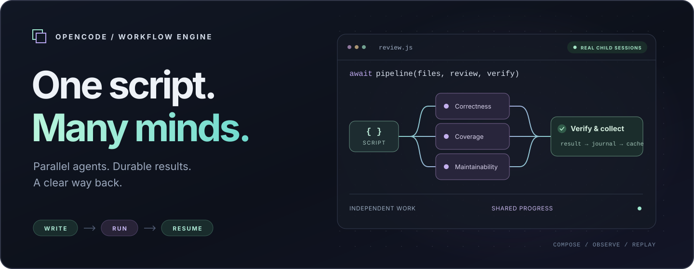
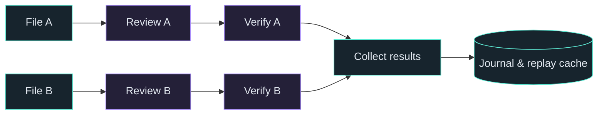

<div align="center">



# OpenCode Workflow Engine

**Give your agents a plan. Give their work a way back.**

JavaScript orchestration for OpenCode with real child sessions,<br />validated results, model controls, and durable replay.

[](package.json) [](#quick-start) [](#development) [](#tested-in-opencode) [](#tested-in-opencode) [](LICENSE)

[Quick start](#quick-start) · [Write a workflow](#write-a-workflow) · [Choose models](#choose-models) · [Resume work](#resume-work) · [Development](#development)

</div>

---

## Work that moves together

Some tasks need several perspectives. Others need a sequence: inspect, implement, verify. Workflow Engine lets an agent express that work as a small JavaScript script, then runs each assignment in its own OpenCode child session.

Use parallel agents when work is independent. Use a pipeline when each item can advance at its own pace. If a run stops, keep the successful results and resume the work that remains.

| Compose | Control | Continue |
| :--- | :--- | :--- |
| **Real JavaScript** — loops, branches, parallel work, and pipelines. | **Your model policy** — inherit the session or select from an allowed pool. | **Durable results** — successful calls are journaled before they return. |
| **Structured handoffs** — schema validation and bounded correction attempts. | **Visible child sessions** — open an agent, skip its task, or stop the run. | **Explicit replay** — reuse matching work across interruptions and script edits. |
| **Named phases** — organize results without changing execution. | **Bounded execution** — concurrency, token dispatch budgets, and timeouts. | **Background runs** — keep working while the workflow finishes. |

> [!NOTE]
> **Current release: 0.1.0.** The server plugin and native management dialogs are implemented. The live sidebar is planned. Worktree isolation is experimental; created worktrees are retained for review.

## Quick start

### 1. Clone and build

With Bun, GitHub CLI, and OpenCode 1.18.29 or later installed:

```sh
gh repo clone pacmm255/opencode-workflow-engine
cd opencode-workflow-engine
bun install --frozen-lockfile
bun run build
```

This repository is private, so the GitHub account used by `gh` needs access.

### 2. Enable the server plugin

Add this entry to your project's `opencode.json`, using the **absolute path** to your checkout:

```json
{
  "plugin": [
    "file:///absolute/path/to/opencode-workflow-engine/dist/server.js"
  ]
}
```

If you already have a `plugin` array, append the entry. Restart OpenCode after changing the configuration.

<details>
<summary><strong>Optional: native model and run dialogs</strong></summary>

Add the TUI entry to the `plugin` array in `tui.json`:

```json
{
  "plugin": [
    "file:///absolute/path/to/opencode-workflow-engine/dist/tui.js"
  ]
}
```

The native `/workflow-config` dialog selects models; `/workflows` opens run details and child sessions, with stop and skip controls. The server commands are also available without the TUI plugin.

For a remote server reached through an SSH tunnel, use the plugin options `{ "remote": true }`:

```json
{
  "plugin": [
    ["file:///absolute/path/to/opencode-workflow-engine/dist/tui.js", { "remote": true }]
  ]
}
```

Remote dialogs prepare requests for the server tools. Local configuration and run files are managed only in local mode.

</details>

### 3. Give it a task

```text
/workflow Review the current changes from correctness and test-coverage perspectives, then verify the findings.
```

The command asks the model to read the authoring reference, write an orchestration script, and run it. Child agents use the invoking session's model by default.

## Write a workflow

Save this as `review.js`. It reviews each file and starts verifying that file as soon as its review is ready.

```js
export const meta = {
  name: "Review → verify",
  description: "Independent file reviews with a second pass",
  phases: [{ title: "Review" }, { title: "Verify" }],
};

const findings = await pipeline(
  args.files,

  file => agent(`Review ${file}. Return concrete findings with locations.`, {
    label: file,
    phase: "Review",
  }),

  (review, file) => agent(`Verify this review of ${file} against the code:\n${review}`, {
    label: file,
    phase: "Verify",
  }),
);

return findings.filter(result => result !== null);
```

Then ask the model to call the **`workflow` tool** with:

```json
{
  "scriptPath": "review.js",
  "args": { "files": ["src/server.ts", "src/core/run/manager.ts"] },
  "background": true,
  "tokenBudget": 20000
}
```

Provide exactly one source: inline `script`, `scriptPath`, or a saved workflow `name`. Scripts run in an async context, so top-level `await` and `return` work directly.



Each item advances independently. `parallel()` provides a barrier when the next step needs every result.

### A small API with room to compose

| API | Purpose |
| :--- | :--- |
| `agent(prompt, options?)` | Run a child session; return text, a validated object, or `null` on failure/skip/timeout. |
| `parallel(thunks)` | Run independent tasks and collect their results in input order. |
| `pipeline(items, ...stages)` | Move each item through stages without a barrier between stages. |
| `workflow(nameOrRef, args)` | Run one nested workflow with shared concurrency, caps, and budget. |
| `phase(title)` / `log(value)` | Name the current phase and record progress. |
| `args` | Access the workflow's JSON input. |
| `budget` | Read the configured total, current spend, and remaining output tokens. |

Read `workflow_reference` inside OpenCode for the full contract, including schemas, variants, timers, failure behavior, and replay. Always await dispatched work; unfinished children are cancelled when the script returns.

## Choose models

Start with the session's model. Use `/workflow-config` when you want a pool of models the orchestrator can choose from. The catalog comes from OpenCode's configured providers, including their available model variants.

Model precedence is explicit:

```text
agent(..., { model })
        ↓ otherwise
explicitly selected agentType's configured model
        ↓ otherwise
workflow models.default
        ↓ otherwise
invoking session's model
```

Exact `provider/model` IDs, aliases, unique short IDs, and variants are supported. Ambiguous names return an error with candidates.

<details>
<summary><strong>Example model policy and limits</strong></summary>

Global settings live in `$XDG_CONFIG_HOME/opencode/workflow.json`, normally `~/.config/opencode/workflow.json`. Project settings live in `.opencode/workflow.json` under the plugin's project directory.

```json
{
  "models": {
    "allowed": ["your-provider/your-model"],
    "default": "session",
    "strict": true,
    "aliases": { "fast": "your-provider/your-model" }
  },
  "limits": { "maxConcurrency": 4 },
  "defaults": { "retries": 1 },
  "sizeGuideline": 15
}
```

Replace the placeholder with an exact ID from `workflow_config show`. Project fields override global fields; arrays replace and aliases merge by name.

In strict mode, explicit model choices and explicitly selected agents' configured models must belong to the allowed pool. Aliases cannot bypass it. Inherited session and workflow defaults remain usable. `sizeGuideline` is advisory; `limits.maxAgents` is the hard cap.

To choose a default for all ordinary workflow agents, set `models.default`. A provider appearing in the catalog does not guarantee that its credentials or quota will succeed.

</details>

## Resume work

A completed agent result is appended and synced to the journal **before** it returns to the script. The final report includes the run ID, script path, result location, and a ready-to-use resume hint.

Pass these arguments to the `workflow` tool:

```json
{
  "scriptPath": "/path/from/the/report/script.js",
  "resumeFromRunId": "wf_<uuid>",
  "args": { "files": ["src/server.ts", "src/core/run/manager.ts"] }
}
```

| Same work | Changed work |
| :--- | :--- |
| A matching prompt and semantic options reuse a successful result. | A changed prompt, schema, model option, or other semantic input starts fresh work. |
| Repeated identical calls consume cached successes in invocation order. | Failed and skipped calls are never stored as successful results. |
| Labels, phases, timeouts, and retry settings can change without losing a match. | Omit `resumeFromRunId` when you need a completely fresh run. |

> [!IMPORTANT]
> Replay reuses earlier results. Filesystem changes and updated model/config defaults do not automatically invalidate them. Supply the arguments needed by the replayed script, and choose a fresh run when freshness matters.

<details>
<summary><strong>What gets saved</strong></summary>

Run data lives in `$XDG_DATA_HOME/opencode/workflow/runs`, normally `~/.local/share/opencode/workflow/runs`.

```text
wf_<uuid>/
├── script.js          Executed script
├── args.json          Supplied arguments
├── run.json           State, phases, agents, usage
├── journal.jsonl      Synced execution journal
├── result.json        Full result, without report truncation
└── agents/
    └── a_1.json       Prompt, options, session, result
```

These records contain prompts and results. Keep them local and private. Interrupted runs are detected after their owning process exits; recovery never restarts work automatically.

</details>

## Stay in control

| Command | What it does |
| :--- | :--- |
| `/workflow <task>` | Author and execute a workflow for the task. |
| `/workflow-config` | Select models and configure policy and limits. |
| `/workflows` | Inspect runs and open child sessions. |
| `/workflow-stop [runId]` | Stop the specified run, or the latest active run. |

The underlying tools are `workflow`, `workflow_reference`, `workflow_runs`, `workflow_saved`, and `workflow_config`. `workflow_runs` exposes `list`, `status`, `stop`, and `skip`; `workflow_saved` manages reusable scripts. Deleting a saved workflow archives it for recovery.

**Foreground** waits for completion and follows the invoking tool's cancellation signal. **Background** owns its own signal, survives the end of that step, and delivers a report when the parent is observed idle.

<details>
<summary><strong>Execution guarantees and practical limits</strong></summary>

- **Agent outcomes:** exhausted failures, skips, and timeouts return `null`. Invalid model/schema choices reject. `parallel` and `pipeline` turn a throwing item into `null`.
- **Token budgets:** spend includes output and reasoning across all attempts. Exhaustion stops new dispatches; agents already running can overshoot the limit. Cached results add no spend.
- **Cancellation:** stop/skip controls abort child sessions. The worker can be terminated even if a script is stuck in an async loop. `STOP` and `SKIP_a_1` files inside the run directory also provide controls.
- **Background delivery:** the parent keeps its current model and agent. OpenCode does not offer an atomic “enqueue if idle” operation, so another turn can race delivery. Reports remain on disk if notification fails.
- **Worktrees:** opt in with `{ isolation: "worktree" }`. Every child operation carries its directory; created worktrees are retained. Merging and deletion are manual.
- **Script runtime:** isolated workers and deterministic VM execution provide stability for trusted model-authored scripts. They are not a security boundary for hostile JavaScript. Child agents retain OpenCode's permission enforcement.

</details>

## Four workflows to start with

| Saved name | Shape | Arguments |
| :--- | :--- | :--- |
| **`review-changes`** | Review correctness, coverage, and maintainability; verify each perspective. | `{ "task": "optional focus" }` |
| **`research`** | Research a question, then independently check and synthesize the evidence. | `{ "question": "…" }` |
| **`audit`** | Inspect reliability across failure handling, persistence, and resource cleanup. | `{ "target": "optional target" }` |
| **`implement-plan`** | Implement ordered tasks, stop on a failed task, then review the result. | `{ "tasks": ["…", "…"] }` |

Example tool input:

```json
{
  "name": "review-changes",
  "args": { "task": "Review the current changes. Focus on cancellation." },
  "background": true
}
```

## Tested in OpenCode

**160 unit tests. Eight real-server integration tests.** Verified with Bun 1.4.2 and OpenCode 1.18.29 on September 8, 2026. These badges describe the recorded verification run, not a hosted CI service.

The integration harness starts a real `opencode serve` with fresh configuration/data directories and a local deterministic model fixture. It exercises parent tool calls and real child sessions while checking that the server stays responsive.

| Verified | Scope |
| :--- | :--- |
| **Orchestration** | Parallel children, native structured output, and cache-only resume. |
| **Lifecycle** | Background survival after parent cancellation, stop, skip, and foreground abort. |
| **Isolation** | A real retained git worktree and its child-session directory. |
| **Plugin surface** | Commands, authoring reference, agent registration, and native dialog APIs. |
| **Failure handling** | Timed-out transports, late replies, schema corrections, and missing-worker initialization. |

Paid-provider behavior, plan quotas, rendered terminal interactions, and the web UI have not been tested. The live sidebar remains planned.

## Development

```sh
bun install --frozen-lockfile
bun run typecheck
bun run test
bun run build
```

Run the isolated OpenCode suite and inspect package contents with:

```sh
bun run test:integration
npm pack --dry-run
```

<details>
<summary><strong>Source map</strong></summary>

```text
src/
├── server.ts          Commands, hooks, tools
├── tui.ts             Native configuration and run dialogs
└── core/
    ├── config.ts      Validated, layered settings
    ├── models.ts      Connected catalog and model policy
    ├── reference.ts   Workflow authoring contract
    ├── script/        Literal metadata and syntax validation
    ├── runtime/       Worker, VM, and host protocol
    └── run/           Execution, persistence, replay, reporting
```

`test/` contains unit tests; `e2e/` contains the real-server harness and local model fixture. `workflows/` contains the four built-in scripts.

Builds emit `dist/server.js`, `dist/tui.js`, `dist/worker.js`, and the runtime authoring guide under `dist/skills/`. Generated artifacts and local AI configuration are excluded from this repository.

</details>

---

<div align="center">

**Write the workflow. Follow the work. Keep the progress.**

[Get started](#quick-start) · [Explore the source](src) · [MIT license](LICENSE)

</div>
