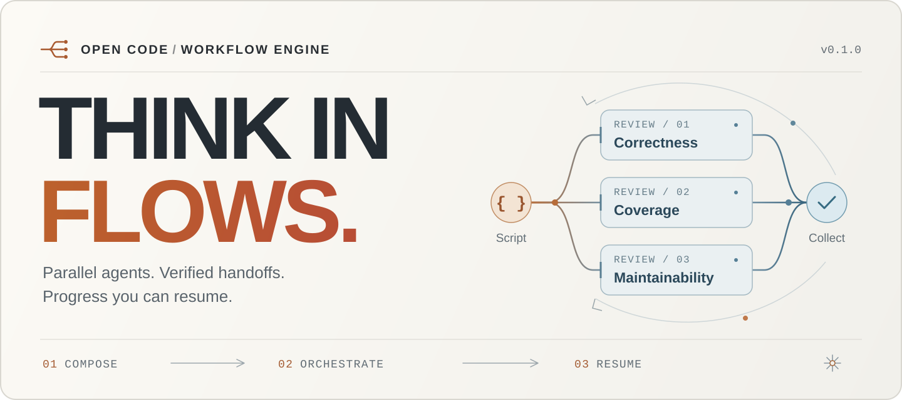
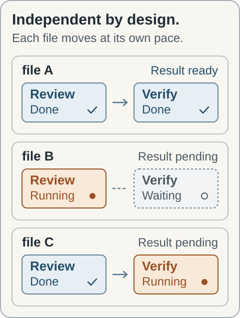

<div align="center">

<picture>
  <source media="(prefers-color-scheme: dark)" srcset="assets/hero-dark.svg" />
  <source media="(prefers-color-scheme: light)" srcset="assets/hero-light.svg" />
  
</picture>

### A small script. A real team of agents. A way to pick up where you left off.

Compose multi-agent work in JavaScript.<br />Run it in real OpenCode child sessions. Keep every successful result.

[](#quick-start) [](#development) [](LICENSE)

**[Get started](#quick-start)** &nbsp; / &nbsp; **[See a workflow](#one-script-many-moving-parts)** &nbsp; / &nbsp; **[Choose models](#your-team-your-models)** &nbsp; / &nbsp; **[Resume work](#keep-the-work-youve-already-done)**

</div>

<br />

<table>
<tr>
<td width="33%" valign="top">
<sub>01 &nbsp; COMPOSE</sub>
<h3>Think beyond one agent.</h3>
<p>Use loops, branches, parallel tasks, and pipelines. Give each assignment its own OpenCode session.</p>
</td>
<td width="33%" valign="top">
<sub>02 &nbsp; COORDINATE</sub>
<h3>Keep the work in view.</h3>
<p>Choose models, validate handoffs, name phases, and open child sessions. Skip a task or stop the run.</p>
</td>
<td width="33%" valign="top">
<sub>03 &nbsp; CONTINUE</sub>
<h3>Save the progress.</h3>
<p>Successful results are journaled before returning. Resume matching work after interruption or a script edit.</p>
</td>
</tr>
</table>

<p align="center"><sub>Version 0.1.0 · Server plugin and native dialogs available · Live sidebar planned</sub></p>

<br />

## One script. Many moving parts.

Review each file, then verify its findings. Each item moves forward as soon as its own review is ready.

```js
const findings = await pipeline(
  args.files,

  file => agent(`Review ${file}. Include concrete findings and locations.`, {
    label: file,
    phase: "Review",
  }),

  (review, file) => {
    if (review === null) return null;
    return agent(`Verify this review of ${file}:\n${review}`, {
      label: file,
      phase: "Verify",
    });
  },
);

return findings.filter(result => result !== null);
```

<picture>
  <source media="(prefers-color-scheme: dark)" srcset="assets/pipeline-dark.svg" />
  <source media="(prefers-color-scheme: light)" srcset="assets/pipeline-light.svg" />
  
</picture>

<p align="center"><sub>Illustrated execution flow. Use <code>parallel()</code> when the next step needs every result.</sub></p>

<br />

## Quick start

**01 — Build the plugin**

Requires Bun, GitHub CLI, and OpenCode 1.18.29 or later. Your GitHub account needs access to this private repository.

```sh
gh repo clone pacmm255/opencode-workflow-engine
cd opencode-workflow-engine
bun install --frozen-lockfile
bun run build
```

**02 — Connect it to OpenCode**

Add the server entry to your project's `opencode.json`. Replace the example with your checkout's **absolute path**; append it if you already have a `plugin` array.

```json
{
  "plugin": [
    "file:///absolute/path/to/opencode-workflow-engine/dist/server.js"
  ]
}
```

**03 — Give it a task**

Restart OpenCode, then:

```text
/workflow Review the current changes from correctness and test-coverage perspectives, then verify the findings.
```

The model reads the authoring reference, writes a workflow, and runs it. Child agents inherit the invoking session's model by default.

<details>
<summary><strong>Add native model and run dialogs</strong></summary>

Add the TUI entry to the `plugin` array in `tui.json`:

```json
{
  "plugin": [
    "file:///absolute/path/to/opencode-workflow-engine/dist/tui.js"
  ]
}
```

`/workflow-config` opens the model picker. `/workflows` opens run details and child sessions, with stop and skip controls. Server commands work without the TUI plugin.

When attaching through an SSH tunnel, mark the TUI connection as remote:

```json
{
  "plugin": [
    ["file:///absolute/path/to/opencode-workflow-engine/dist/tui.js", { "remote": true }]
  ]
}
```

Remote dialogs prepare requests for the server tools. Direct management of local configuration and run files is available in local mode.

</details>

<details>
<summary><strong>Run your own script</strong></summary>

Save the earlier example as `review.js`, then ask the model to call the `workflow` tool with:

```json
{
  "scriptPath": "review.js",
  "args": { "files": ["src/server.ts", "src/core/run/manager.ts"] },
  "background": true,
  "tokenBudget": 20000
}
```

Supply exactly one source: inline `script`, `scriptPath`, or a saved workflow `name`. Scripts run in an async body with top-level `await` and `return`. Optional `export const meta` accepts literal metadata.

Always await dispatched work and handle `null` results. Any unfinished child calls are cancelled when the script returns.

</details>

<br />

## Your team. Your models.

Use the session's model to get started. Open `/workflow-config` when you want an allowed pool or a different default. The catalog comes from OpenCode's configured providers and includes their model variants. Set aliases and hard execution limits through `workflow_config` or configuration JSON.

**Explicit choice → selected agent's model → workflow default → session model.**

Exact `provider/model` IDs, aliases, unique short IDs, and variants are supported. Ambiguous names produce an error with candidates.

<details>
<summary><strong>Configure a model pool and execution limits</strong></summary>

```json
{
  "models": {
    "allowed": ["your-provider/your-model"],
    "default": "session",
    "strict": true,
    "aliases": { "fast": "your-provider/your-model" }
  },
  "limits": { "maxConcurrency": 4 },
  "defaults": { "retries": 1 },
  "sizeGuideline": 15
}
```

Use exact IDs from `workflow_config show`. Global settings live in `$XDG_CONFIG_HOME/opencode/workflow.json`, normally `~/.config/opencode/workflow.json`; project overrides live in `.opencode/workflow.json` under the plugin's project directory.

Project fields override global fields. Arrays replace; aliases merge by name. In strict mode, explicit choices and explicitly selected `agentType` models must belong to the allowed pool. Aliases cannot bypass it. Inherited session and workflow defaults remain usable.

`models.default` sets the model for ordinary workflow agents. `sizeGuideline` is advisory; `limits.maxAgents` is the hard cap. A configured provider can still fail because of credentials or quota.

</details>

<br />

## Keep the work you've already done.

Each successful agent result is **appended and synced before it returns**. If a run stops, the report gives you the script path and run ID needed to resume.

```json
{
  "scriptPath": "/path/from/the/report/script.js",
  "resumeFromRunId": "wf_<uuid>",
  "args": { "files": ["src/server.ts", "src/core/run/manager.ts"] }
}
```

Matching prompts and semantic options reuse successful results. Changed work runs again. Labels, phases, timeouts, and retry settings can change without losing a match; cached results add no token spend.

> [!IMPORTANT]
> Replay reuses earlier results. Source changes and updated model/config defaults do not automatically invalidate them. Supply the script's arguments again, and omit `resumeFromRunId` when you need fresh results.

<details>
<summary><strong>Inside a saved run</strong></summary>

```text
wf_<uuid>/
├── script.js          The executed script
├── args.json          Its arguments
├── run.json           State, phases, agents, and usage
├── journal.jsonl      Synced execution journal
├── result.json        The complete result
└── agents/
    └── a_1.json       Prompt, options, session, and result
```

Runs live in `$XDG_DATA_HOME/opencode/workflow/runs`, normally `~/.local/share/opencode/workflow/runs`. Records contain prompts and results; keep them local and private.

Repeated identical calls consume cached successes in invocation order. Failed/skipped calls are never cached as successes. Prompt, schema, model options, agent type, system text, isolation, and tool choices affect matching.

Runs whose owning process has exited are marked interrupted. Recovery never restarts them automatically.

</details>

<br />

## A few good starting points.

| Workflow | What happens | Input |
| :--- | :--- | :--- |
| **[`review-changes`](workflows/review-changes.js)** | Review from three perspectives, then verify each set of findings. | `{ "task": "optional focus" }` |
| **[`research`](workflows/research.js)** | Research a question, then check and synthesize the evidence. | `{ "question": "…" }` |
| **[`audit`](workflows/audit.js)** | Inspect failure handling, persistence, and resource cleanup. | `{ "target": "optional target" }` |
| **[`implement-plan`](workflows/implement-plan.js)** | Implement ordered tasks, stop on failure, and review the result. | `{ "tasks": ["…", "…"] }` |

Call the `workflow` tool with a saved name:

```json
{
  "name": "review-changes",
  "args": { "task": "Review the current changes. Focus on cancellation." },
  "background": true
}
```

<details>
<summary><strong>The scripting API</strong></summary>

| API | Purpose |
| :--- | :--- |
| `agent(prompt, options?)` | Run a child; receive text, a validated object, or `null` on failure/skip/timeout. |
| `parallel(thunks)` | Run independent tasks and collect results in input order. |
| `pipeline(items, ...stages)` | Advance each item through stages independently. |
| `workflow(nameOrRef, args)` | Run one nested workflow with shared concurrency, caps, and budget. |
| `phase(title)` / `log(value)` | Organize phases and record progress. |
| `args` | Access the supplied JSON arguments. |
| `budget` | Read the configured total, spend, and remaining output tokens. |

Read `workflow_reference` in OpenCode for schemas, variants, timers, nesting, failure behavior, and replay semantics.

</details>

<details>
<summary><strong>Commands, controls, and execution behavior</strong></summary>

| Command | Action |
| :--- | :--- |
| `/workflow <task>` | Author and execute a workflow. |
| `/workflow-config` | Choose models, strict policy, and advisory workflow size. |
| `/workflows` | Inspect runs and child sessions. |
| `/workflow-stop [runId]` | Stop a run, or the latest active one. |

The tools are `workflow`, `workflow_reference`, `workflow_runs`, `workflow_saved`, and `workflow_config`. `workflow_runs` provides list/status/stop/skip actions. Deleting a saved script with `workflow_saved` archives it for recovery.

**Foreground** waits for completion and follows the invoking tool's cancellation signal. **Background** owns its own signal, survives the end of that step, and reports when the parent is observed idle.

- **Outcomes:** failures after retries, skips, and agent timeouts return `null`; deterministic model/schema errors reject. Parallel/pipeline item exceptions become `null`.
- **Budgets:** output and reasoning across all attempts count toward spend. Exhaustion stops new dispatches; already-running agents can overshoot.
- **Cancellation:** workers and children are stopped. `STOP` and `SKIP_a_1` files in the run directory also provide controls.
- **Delivery:** the parent retains its current model and agent. Another turn can race the idle check; reports remain on disk if notification fails.
- **Worktrees:** `{ isolation: "worktree" }` is experimental. Created worktrees are retained; merge and remove them manually.
- **Trust:** the worker and VM provide stability for trusted model-authored scripts, not a security boundary for hostile JavaScript. Child agents retain OpenCode permissions.

</details>

<br />

## Tested where the work happens.

<table>
<tr>
<td width="33%" align="center"><h2>160</h2><p>unit tests passed</p></td>
<td width="33%" align="center"><h2>8</h2><p>real-server integration tests passed</p></td>
<td width="33%" align="center"><h2>1.18.29</h2><p>OpenCode version verified</p></td>
</tr>
</table>

The integration harness starts a real OpenCode server with isolated configuration and a local deterministic model fixture. It checks actual child sessions, native structured output, resume, background survival, stop/skip, parent cancellation, and a retained git worktree.

<details>
<summary><strong>Verification scope</strong></summary>

Recorded on September 8, 2026 with Bun 1.4.2 and OpenCode 1.18.29. These are recorded test results, not live CI indicators.

Unit coverage includes model/config policy, schemas, replay, cancellation, timed-out transports, late replies, missing-worker initialization, plugin registration, and native dialog APIs.

Paid-provider behavior, plan quotas, rendered terminal interactions, and the web UI have not been tested. The live sidebar is not implemented.

</details>

<br />

## Development

```sh
bun install --frozen-lockfile
bun run typecheck
bun run test
bun run build
```

For the isolated OpenCode suite and package contents:

```sh
bun run test:integration
npm pack --dry-run
```

<details>
<summary><strong>Find your way around the source</strong></summary>

```text
src/
├── server.ts          Commands, hooks, and tools
├── tui.ts             Native configuration and run dialogs
└── core/
    ├── config.ts      Validated, layered settings
    ├── models.ts      Connected catalog and model policy
    ├── reference.ts   Workflow authoring contract
    ├── script/        Literal metadata and syntax validation
    ├── runtime/       Worker, VM, and host protocol
    └── run/           Execution, persistence, replay, reporting
```

`test/` contains unit tests. `e2e/` contains the real-server harness and local model fixture. `workflows/` contains the built-in scripts.

Builds produce `dist/server.js`, `dist/tui.js`, `dist/worker.js`, and the runtime authoring guide in `dist/skills/`. Generated files and local AI configuration are excluded from GitHub.

</details>

<br />

---

<div align="center">

### Build together. Keep the progress.

**[Start your first workflow](#quick-start)** &nbsp; · &nbsp; [Explore the source](src) &nbsp; · &nbsp; [MIT license](LICENSE)

<sub>OPENCODE WORKFLOW ENGINE &nbsp; / &nbsp; v0.1.0</sub>

</div>
